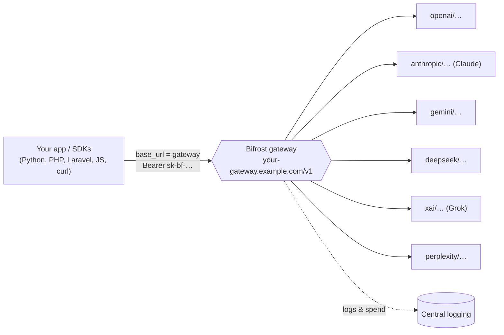

<div align="center">

# 🌉 Bifrost Gateway Integration Skill

**Route every LLM call — OpenAI, Claude, Gemini, DeepSeek, Grok, Perplexity — through one OpenAI‑compatible gateway, so nothing bypasses your logging.**

[](LICENSE)
[](CONTRIBUTING.md)
[](https://docs.anthropic.com/en/docs/agents-and-tools/agent-skills/overview)
[](https://github.com/maximhq/bifrost)
[](examples)

**English** · [Русский](README.ru.md)

</div>

---

An [Agent Skill](https://docs.anthropic.com/en/docs/agents-and-tools/agent-skills/overview)
that teaches Claude (and gives developers copy‑paste examples) to send **every**
AI‑provider request through a [Bifrost](https://github.com/maximhq/bifrost)
OpenAI‑compatible gateway — for centralized **logging, spend tracking, failover,
and one place to manage keys** — instead of calling each provider directly.

Install the skill and Claude will wire up new and existing LLM code to the gateway
automatically, in any language. No skill? The [`examples/`](examples) still work as
a plain multi‑language integration reference.

## Contents

- [Why](#why)
- [How it works](#how-it-works)
- [Quickstart](#quickstart)
- [Provider &amp; model naming](#provider--model-naming)
- [Responses API vs Chat Completions](#responses-api-vs-chat-completions)
- [The skill (EN + RU)](#the-skill-en--ru)
- [Examples](#examples)
- [Contributing](#contributing)
- [License](#license)

## Why

As soon as an app talks to more than one model, LLM calls scatter across SDKs and
providers. There's no single place to see **what was asked, what it cost, and
which model answered** — and every service holds its own provider keys.

A Bifrost gateway fixes this by speaking the **OpenAI protocol** for all providers.
You change **one line** — the base URL — and keep using the SDK you already have.
Every request now flows through one endpoint that logs it, tracks spend, and can
fail over between providers.

```diff
- base_url = "https://api.openai.com/v1"
+ base_url = "https://your-gateway.example.com/v1"   # everything is logged now
  model    = "openai/gpt-4o-mini"                     # provider/model
```

## How it works



Three constants are all you ever need:

1. **Base URL** — `https://your-gateway.example.com/v1`
2. **Model string** — `provider/model` (e.g. `openai/gpt-4o-mini`)
3. **Auth** — `Authorization: Bearer sk-bf-…` (your gateway key)

## Quickstart

> **No gateway yet?** Stand one up with Bifrost in ~30 seconds —
> `docker run -p 8080:8080 maximhq/bifrost` — then follow the
> [Bifrost quick start](skills/bifrost-gateway/references/install-bifrost.md).

**1. Install the skill** (for Claude Code / Claude apps). Copy a variant into your
personal skills directory:

```bash
# English variant
cp -r skills/bifrost-gateway ~/.claude/skills/bifrost-gateway
# …or the Russian variant
cp -r skills/bifrost-gateway-ru ~/.claude/skills/bifrost-gateway-ru
```

Now, whenever you ask Claude to write or fix code that calls an LLM, it routes
through the gateway automatically.

**2. Point it at your gateway.** Copy [`.env.example`](.env.example) to `.env`:

```bash
BIFROST_BASE_URL=https://your-gateway.example.com/v1
BIFROST_API_KEY=sk-bf-xxxxxxxxxxxxxxxx
```

**3. Try it** (curl, Responses API):

```bash
curl "$BIFROST_BASE_URL/responses" \
  -H "Authorization: Bearer $BIFROST_API_KEY" \
  -H "Content-Type: application/json" \
  -d '{ "model": "openai/gpt-4o-mini", "input": "Hello!" }'
```

## Provider &amp; model naming

On the unified endpoint the model is always `provider/model`. The prefix is the
**canonical Bifrost key**, not the everyday product name — Claude and Grok are the
easy ones to get wrong:

| Provider (common name) | prefix | example |
|---|---|---|
| OpenAI | `openai` | `openai/gpt-4o-mini` |
| **Claude** (Anthropic) | `anthropic` ⚠️ not `claude/` | `anthropic/claude-3-5-sonnet-20241022` |
| Gemini (Google) | `gemini` | `gemini/gemini-2.0-flash` |
| DeepSeek | `deepseek` | `deepseek/deepseek-chat` |
| **Grok** (xAI) | `xai` ⚠️ not `grok/` | `xai/grok-2-latest` |
| Perplexity | `perplexity` | `perplexity/sonar-pro` |

Which providers are available depends on your gateway config. Exact model names,
parameters, and **live pricing** come from the Bifrost datasheet:
[models](https://getbifrost.ai/datasheet) ·
[parameters](https://getbifrost.ai/datasheet/model-parameters).

## Responses API vs Chat Completions

Prefer the newer **Responses API** (`/v1/responses`); the gateway translates it for
every provider. Fall back to **Chat Completions** (`/v1/chat/completions`) only
when a client/SDK can't do Responses. Both use the same key and `provider/model`.

## The skill (EN + RU)

| Path | Language |
|---|---|
| [`skills/bifrost-gateway/`](skills/bifrost-gateway) | English |
| [`skills/bifrost-gateway-ru/`](skills/bifrost-gateway-ru) | Русский |

Each skill has a `SKILL.md` plus `references/` covering models &amp; parameters,
native‑SDK drop‑ins, JS/frameworks, and PHP/Laravel. Learn what a skill is in the
[Agent Skills docs](https://docs.anthropic.com/en/docs/agents-and-tools/agent-skills/overview).

## Examples

Runnable, minimal, env‑driven references for every stack:

| Path | What's inside |
|---|---|
| [`examples/python/`](examples/python) | OpenAI SDK (Responses + chat), raw `requests` |
| [`examples/php/`](examples/php) | `openai-php/client`, raw cURL |
| [`examples/laravel/`](examples/laravel) | Laravel AI SDK (`openai-compatible` provider, agent) |
| [`examples/javascript/`](examples/javascript) | OpenAI SDK, `fetch`, Vercel AI SDK |
| [`examples/curl/`](examples/curl) | `responses.sh`, `chat.sh` |

## Contributing

New languages and frameworks are very welcome — see [CONTRIBUTING.md](CONTRIBUTING.md).
A CI check keeps every example consistent and env‑driven.

## License

[MIT](LICENSE).

> Not affiliated with Maxim or the Bifrost project. "Bifrost" refers to the
> open‑source [maximhq/bifrost](https://github.com/maximhq/bifrost) gateway; this
> repo is an independent community integration skill and works with any
> OpenAI‑compatible gateway.
