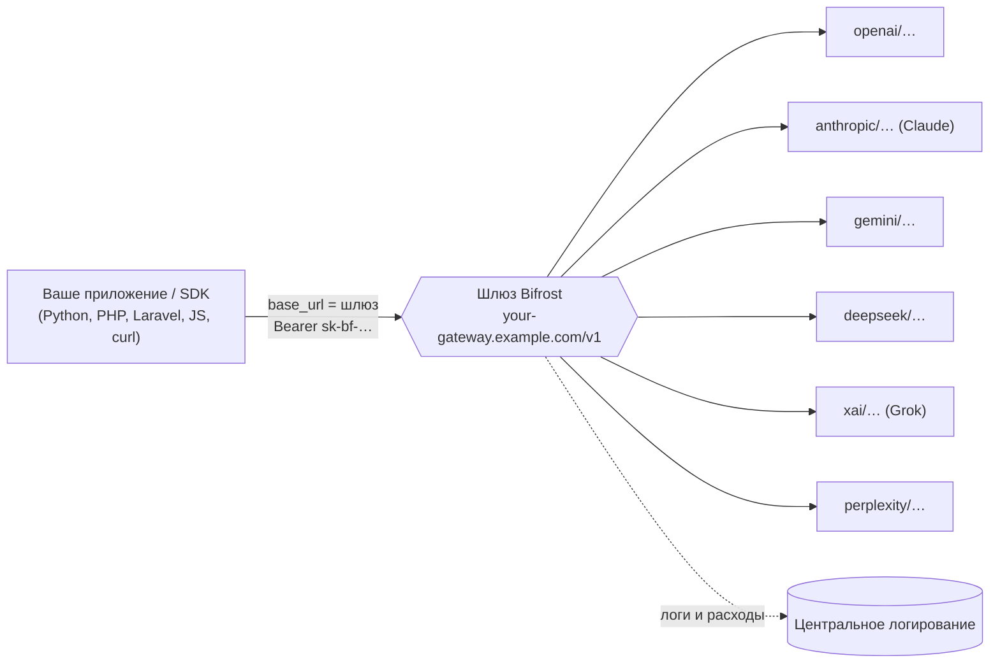

<div align="center">

# 🌉 Bifrost Gateway Integration Skill

**Направьте любой вызов LLM — OpenAI, Claude, Gemini, DeepSeek, Grok, Perplexity — через один OpenAI‑совместимый шлюз, чтобы ни один запрос не шёл мимо логирования.**

[](LICENSE)
[](CONTRIBUTING.md)
[](https://docs.anthropic.com/en/docs/agents-and-tools/agent-skills/overview)
[](https://github.com/maximhq/bifrost)
[](examples)

[English](README.md) · **Русский**

</div>

---

[Agent Skill](https://docs.anthropic.com/en/docs/agents-and-tools/agent-skills/overview),
который учит Claude (и даёт разработчикам готовые примеры) отправлять **каждый**
запрос к ИИ‑провайдеру через OpenAI‑совместимый шлюз
[Bifrost](https://github.com/maximhq/bifrost) — ради централизованного
**логирования, учёта расходов, failover и единого места хранения ключей** —
вместо прямых обращений к провайдерам.

Поставьте скилл — и Claude сам подключит к шлюзу новый и существующий LLM‑код на
любом языке. Нет скилла? Папка [`examples/`](examples) всё равно работает как
мультиязычный справочник по интеграции.

## Содержание

- [Зачем](#зачем)
- [Как это работает](#как-это-работает)
- [Быстрый старт](#быстрый-старт)
- [Провайдеры и формат модели](#провайдеры-и-формат-модели)
- [Responses API против Chat Completions](#responses-api-против-chat-completions)
- [Скилл (EN + RU)](#скилл-en--ru)
- [Примеры](#примеры)
- [Как помочь проекту](#как-помочь-проекту)
- [Лицензия](#лицензия)

## Зачем

Как только приложение обращается больше чем к одной модели, вызовы LLM
расползаются по разным SDK и провайдерам. Нет единого места, где видно, **что
спрашивали, сколько это стоило и какая модель ответила**, — и у каждого сервиса
свой ключ провайдера.

Шлюз Bifrost решает это, говоря на **протоколе OpenAI** для всех провайдеров. Вы
меняете **одну строку** — базовый URL — и продолжаете пользоваться тем же SDK.
Теперь каждый запрос идёт через один эндпоинт, который его логирует, считает
расходы и умеет переключаться между провайдерами.

```diff
- base_url = "https://api.openai.com/v1"
+ base_url = "https://your-gateway.example.com/v1"   # теперь всё логируется
  model    = "openai/gpt-4o-mini"                     # провайдер/модель
```

## Как это работает



Всё, что нужно, — три константы:

1. **Базовый URL** — `https://your-gateway.example.com/v1`
2. **Строка модели** — `провайдер/модель` (напр. `openai/gpt-4o-mini`)
3. **Авторизация** — `Authorization: Bearer sk-bf-…` (ключ вашего шлюза)

## Быстрый старт

> **Ещё нет шлюза?** Поднимите Bifrost за ~30 секунд —
> `docker run -p 8080:8080 maximhq/bifrost` — и следуйте
> [быстрому старту Bifrost](skills/bifrost-gateway-ru/references/install-bifrost.md).

**1. Установите скилл** (для Claude Code / приложений Claude). Скопируйте нужный
вариант в свою папку скиллов:

```bash
# английский вариант
cp -r skills/bifrost-gateway ~/.claude/skills/bifrost-gateway
# …или русский вариант
cp -r skills/bifrost-gateway-ru ~/.claude/skills/bifrost-gateway-ru
```

Теперь, когда вы просите Claude написать или поправить код с вызовом LLM, он сам
маршрутизирует его через шлюз.

**2. Укажите свой шлюз.** Скопируйте [`.env.example`](.env.example) в `.env`:

```bash
BIFROST_BASE_URL=https://your-gateway.example.com/v1
BIFROST_API_KEY=sk-bf-xxxxxxxxxxxxxxxx
```

**3. Проверьте** (curl, Responses API):

```bash
curl "$BIFROST_BASE_URL/responses" \
  -H "Authorization: Bearer $BIFROST_API_KEY" \
  -H "Content-Type: application/json" \
  -d '{ "model": "openai/gpt-4o-mini", "input": "Привет!" }'
```

## Провайдеры и формат модели

На едином эндпоинте модель всегда `провайдер/модель`. Префикс — это **каноничный
ключ Bifrost**, а не разговорное имя. Легче всего ошибиться с Claude и Grok:

| Провайдер (как называют) | префикс | пример |
|---|---|---|
| OpenAI | `openai` | `openai/gpt-4o-mini` |
| **Claude** (Anthropic) | `anthropic` ⚠️ не `claude/` | `anthropic/claude-3-5-sonnet-20241022` |
| Gemini (Google) | `gemini` | `gemini/gemini-2.0-flash` |
| DeepSeek | `deepseek` | `deepseek/deepseek-chat` |
| **Grok** (xAI) | `xai` ⚠️ не `grok/` | `xai/grok-2-latest` |
| Perplexity | `perplexity` | `perplexity/sonar-pro` |

Набор провайдеров зависит от конфигурации вашего шлюза. Точные имена моделей,
параметры и **актуальные цены** — из даташита Bifrost:
[модели](https://getbifrost.ai/datasheet) ·
[параметры](https://getbifrost.ai/datasheet/model-parameters).

## Responses API против Chat Completions

Предпочитайте более новый **Responses API** (`/v1/responses`); шлюз транслирует
его для любого провайдера. На **Chat Completions** (`/v1/chat/completions`)
падайте только там, где клиент/SDK не умеет Responses. Оба используют один ключ и
формат `провайдер/модель`.

## Скилл (EN + RU)

| Путь | Язык |
|---|---|
| [`skills/bifrost-gateway/`](skills/bifrost-gateway) | English |
| [`skills/bifrost-gateway-ru/`](skills/bifrost-gateway-ru) | Русский |

У каждого скилла есть `SKILL.md` и папка `references/`: модели и параметры,
drop‑in нативных SDK, JS/фреймворки, PHP/Laravel. Что такое скилл — в
[документации Agent Skills](https://docs.anthropic.com/en/docs/agents-and-tools/agent-skills/overview).

## Примеры

Минимальные рабочие примеры на всех стеках, всё через переменные окружения:

| Путь | Что внутри |
|---|---|
| [`examples/python/`](examples/python) | OpenAI SDK (Responses + chat), сырой `requests` |
| [`examples/php/`](examples/php) | `openai-php/client`, сырой cURL |
| [`examples/laravel/`](examples/laravel) | Laravel AI SDK (провайдер `openai-compatible`, агент) |
| [`examples/javascript/`](examples/javascript) | OpenAI SDK, `fetch`, Vercel AI SDK |
| [`examples/curl/`](examples/curl) | `responses.sh`, `chat.sh` |

## Как помочь проекту

Новые языки и фреймворки очень приветствуются — см. [CONTRIBUTING.md](CONTRIBUTING.md).
CI‑проверка следит, чтобы все примеры были единообразны и работали через
переменные окружения.

## Лицензия

[MIT](LICENSE).

> Проект не аффилирован с Maxim или Bifrost. «Bifrost» — это опенсорсный шлюз
> [maximhq/bifrost](https://github.com/maximhq/bifrost); данный репозиторий —
> независимый community‑скилл и работает с любым OpenAI‑совместимым шлюзом.
